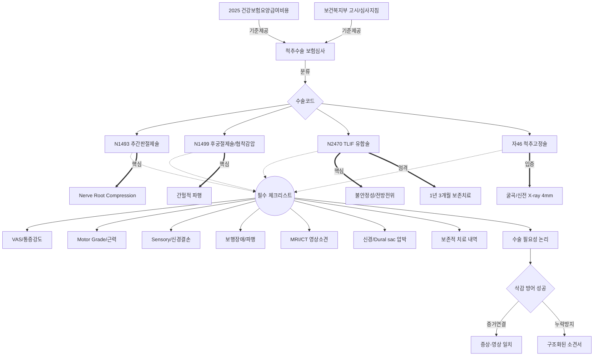

# 🧠 척추수술 보험심사 온톨로지 지식 그래프

본 문서는 척추수술 보험심사 체계를 **온톨로지(Ontology)** 형태로 구조화하여, 데이터 간의 상관관계를 시각화하고 자동화 엔진이 추론할 수 있는 지식 기반을 제공합니다.

## 1. 지식 그래프 시각화 (Mermaid)

## 2. 온톨로지 정의 (Entities & Relations)

### A. 주요 엔티티 (Classes)
- **Standard (표준):** 심사의 법적/행정적 근거 (HIRA 기준, 복지부 고시).
- **SurgeryCode (수술코드):** 심사의 대상이 되는 특정 의료 행위 코드.
- **Requirement (요건):** 심사를 통과하기 위해 의무기록에 반드시 포함되어야 할 데이터 포인트.
- **Indicator (지표):** 요건의 충족 여부를 판단하는 구체적인 수치나 소견 (VAS 7, Motor 4 등).

### B. 핵심 관계 (Properties)
- `requires (필요로 함)`: 특정 수술코드가 특정 요건을 반드시 포함해야 함.
- `proves (입증함)`: 특정 영상 소견이 수술의 필요성을 입증함.
- `governedBy (규제됨)`: 심사 절차가 특정 고시나 지침의 영향을 받음.
- `correlatesWith (상관관계)`: 임상 증상과 영상 소견이 일치함.

## 3. 자동화 추론 로직 (Inference Rules)
본 온톨로지를 바탕으로 에이전트는 다음과 같이 추론합니다:
1. **IF** 수술코드가 `N2470`이고 **AND** 보존적 치료 기간이 `3개월 미만`이라면 **THEN** `삭감 위험(High)` 경고 발생.
2. **IF** `MRI상 신경 압박`이 있으나 **AND** `방사통 증상` 기록이 없다면 **THEN** `Clinical Correlation 누락`으로 판단하여 추가 기재 요청.
3. **IF** `자46` 고정술을 시행했으나 **AND** `굴곡/신전 X-ray` 수치가 없다면 **THEN** `객관적 근거 부족`으로 리포트.

---
**파일 저장 위치:** `척추심사_자동화/척추심사_온톨로지_시각화.md`
